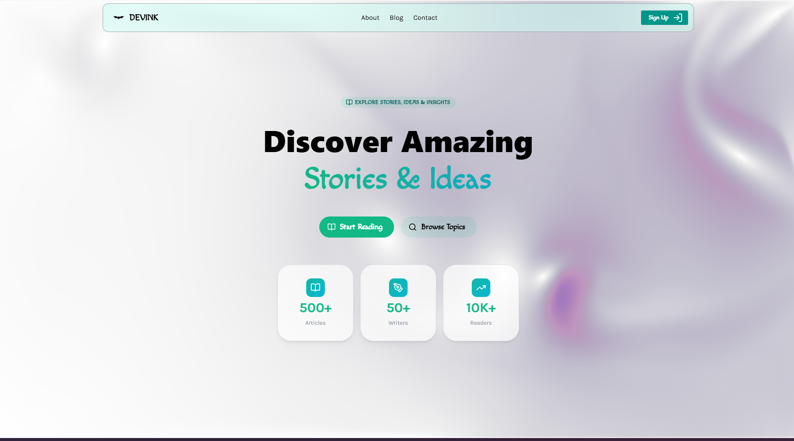

# DEVINK - A Platform for Writers & Content Creators



Welcome to **DEVINK**, a modern and elegant platform designed for writers and content creators. Built with cutting-edge technologies, DEVINK offers a seamless experience for discovering, reading, and sharing quality content.

## 🔗 Links

- **Live Website:** [https://devink-drab.vercel.app/](https://devink-drab.vercel.app/)
- **GitHub Repository:** [https://github.com/Ryusen9/devink](https://github.com/Ryusen9/devink)

## 🎯 Features

- ✨ **Smooth Animations** - GSAP-powered animations for elegant interactions
- 📱 **Responsive Design** - Works beautifully on all devices
- 🎨 **Modern UI** - Mantine UI components for a polished interface
- 📝 **Contact Forms** - Easy-to-use contact and authentication forms
- 🔐 **Authentication** - Secure signup and login modals
- 🎬 **Rich Media** - Lottie animations and Three.js 3D elements
- ⚡ **Performance** - Optimized with Next.js for fast load times

## 🛠️ Tech Stack

### Frontend Framework

- **Next.js** `16.1.3` - React framework with server-side rendering
- **React** `19.2.3` - UI library
- **TypeScript** `5` - Type-safe JavaScript

### UI & Styling

- **Mantine UI** - Component library
  - `@mantine/core` `8.3.12` - Core components
  - `@mantine/hooks` `8.3.12` - React hooks
  - `@mantine/form` `8.3.12` - Form management
  - `@mantine/carousel` `8.3.13` - Carousel component
- **Tailwind CSS** `4` - Utility-first CSS framework
- **PostCSS** `8.5.6` - CSS transformations
  - `postcss-preset-mantine` `1.18.0`
  - `postcss-simple-vars` `7.0.1`

### Animation & Motion

- **GSAP** `3.14.2` - Professional animation library
- **Framer Motion** `12.29.0` - Declarative animations
- **Lenis** `1.3.17` - Smooth scrolling
- **Lottie React** `2.4.1` - Lottie animations

### 3D Graphics

- **Three.js** `0.182.0` - 3D graphics library
- **PostProcessing** `6.38.2` - Three.js post-processing effects

### Icons & Assets

- **Tabler Icons React** `3.36.1` - Icon library
- **Lucide React** `0.562.0` - Icon set

### Utilities

- **Embla Carousel** `8.6.0` - Lightweight carousel
- **Tailwind Merge** `3.4.0` - Merge Tailwind CSS classes
- **Class Variance Authority** `0.7.1` - CSS-in-JS utility

### Development Tools

- **ESLint** `9` - Code linting
- **Tailwind CSS** `4` - CSS framework

## 🚀 Getting Started

### Prerequisites

- Node.js 18+
- npm or yarn

### Installation

1. Clone the repository:

```bash
git clone https://github.com/Ryusen9/devink.git
cd devink
```

2. Install dependencies:

```bash
npm install
```

3. Run the development server:

```bash
npm run dev
```

4. Open [http://localhost:3000](http://localhost:3000) in your browser to see the result.

### Available Scripts

```bash
# Development server
npm run dev

# Build for production
npm run build

# Start production server
npm start

# Run ESLint
npm run lint
```

## 📁 Project Structure

```
devink/
├── src/
│   ├── app/                 # Next.js app directory
│   │   ├── (main)/         # Main layout group
│   │   │   ├── about/      # About page
│   │   │   ├── contact/    # Contact page
│   │   │   └── components/ # Page components
│   │   ├── layout.tsx      # Root layout
│   │   ├── page.tsx        # Home page
│   │   └── globals.css     # Global styles
│   ├── Components/         # Reusable components
│   │   ├── Background/
│   │   ├── Smoothscroll/
│   │   └── ui/
│   ├── Layouts/            # Layout components
│   │   ├── Navbar/
│   │   └── Footer/
│   ├── Constants/          # Constants and config
│   └── lib/                # Utility functions
├── public/                 # Static assets
├── package.json
├── tailwind.config.ts
└── tsconfig.json
```

## 🎨 Key Components

### Contact Page

A beautiful contact form with smooth GSAP animations and Teal theme:

- Form validation with error messages
- Success state animation
- Responsive design

### Authentication Modal

Secure signup and login forms:

- Form validation
- Password confirmation
- Toggle between signup and login
- Console logging for form data

### Navbar & Footer

Responsive navigation and footer with smooth interactions

## 🌐 Deployment

This project is deployed on [Vercel](https://vercel.com/), optimized for:

- **Speed** - Automatic optimization
- **SEO** - Built-in support
- **Analytics** - Performance monitoring

## 📝 License

This project is open source and available under the MIT License.

## 👨‍💻 Author

Created with ❤️ by [Ryusen9](https://github.com/Ryusen9)

## 🤝 Contributing

Contributions are welcome! Feel free to:

1. Fork the repository
2. Create a feature branch (`git checkout -b feature/amazing-feature`)
3. Commit your changes (`git commit -m 'Add amazing feature'`)
4. Push to the branch (`git push origin feature/amazing-feature`)
5. Open a Pull Request

## 💬 Support

For support, please open an issue on the [GitHub repository](https://github.com/Ryusen9/devink/issues)

---

**Built with passion and modern web technologies** ✨
